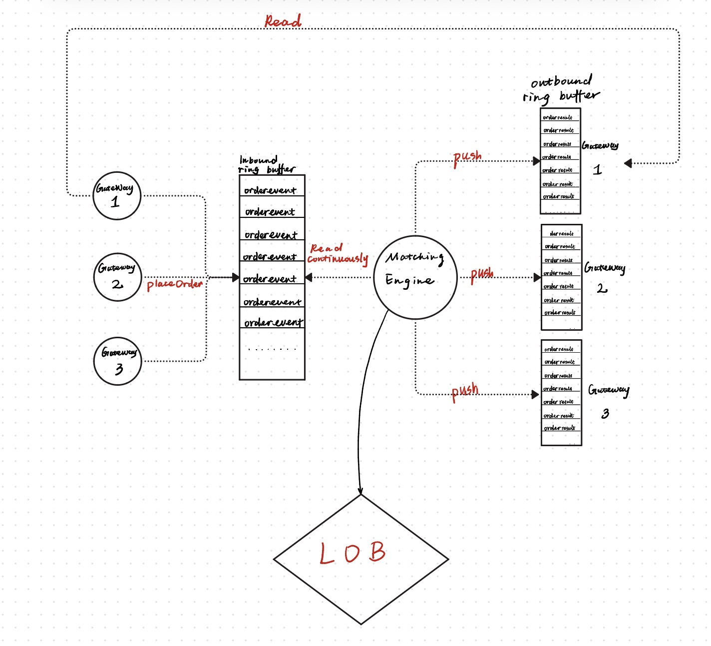

# High-Performance Limit Order Book (LOB)

A low-latency limit order book engine written in C++, inspired by the LMAX Disruptor pattern.

## Architecture



Multiple gateways accept orders from users and write them into a shared **inbound ring buffer**. A single-threaded **matching engine** continuously polls the buffer, processes each order against the LOB, and pushes results into per-gateway **outbound ring buffers** for delivery back to users.

## Key Design Decisions

**Intrusive Linked List**
Each price level (`Limit`) manages a doubly linked list of `Order` nodes directly — the `next`/`prev` pointers live inside `Order` itself rather than in a wrapper node. This avoids the heap allocation overhead of `std::list` and enables O(1) cancellation via the `parentlimit` back-pointer.

**Lock-Free Inbound Ring Buffer**
Multiple gateway threads concurrently claim slots via an atomic `fetch_add` on the write pointer. The matching engine polls `is_ready` with `memory_order_acquire` to guarantee it sees fully written order data before processing. Buffer size is constrained to powers of 2 so slot indexing uses a bitmask instead of modulo.

**Single-Threaded Matching Engine**
The matching engine is intentionally single-threaded. Order matching requires strict price-time priority and deterministic sequencing — concurrency inside the LOB would require locks and introduce non-determinism. Serialization happens at the ring buffer instead.

**Per-Gateway Outbound Ring Buffers**
Each gateway has its own outbound ring buffer. The matching engine routes results by `gateway_id`, and each buffer has an independent write pointer. Since there is only one writer (the matching engine), the outbound write pointer does not need to be atomic.

## Components

| File | Description |
|------|-------------|
| `orderbook.hpp/cpp` | LOB core — `match()`, `cancel()`, `placeOrder()` |
| `ring_buffer.hpp/cpp` | Inbound and outbound ring buffer implementations |
| `gateway.hpp/cpp` | User-facing API — translates user orders into ring buffer events |
| `matching_engine.hpp/cpp` | Polling loop — bridges inbound buffer, LOB, and outbound buffers |

## Order Flow

```
User
 └→ Gateway::place_order_to_ring_buffer()
        ├→ Atomically claim inbound slot
        ├→ Write Orderevent (price, volume, side, gateway_id, timestamp)
        └→ Publish (is_ready = true)

MatchingEngine::run()  ← single thread
 └→ Poll inbound buffer for is_ready
        ├→ Orderbook::placeOrder() → match()
        ├→ Release inbound slot
        ├→ Write orderResult to outbound ring buffer
        └→ Publish to gateway
```
